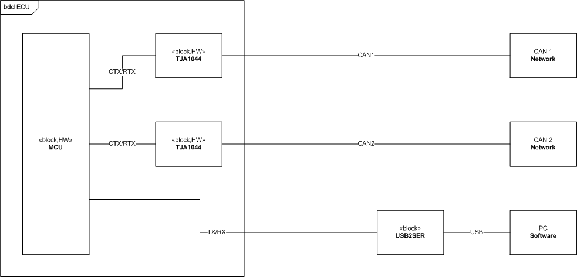

# DualCAN_F105

Dual CAN on STM32F105

## 1. Hardware

### 1.1. Development Board

Where to get the development board? Goto taobao:

https://item.taobao.com/item.htm?id=589316513548

Select STM32F105RCT6

### 1.2. Hardware Overview

## 2. Software

### 2.1. Tools

**STM32CubeIDE (V1.2.0)**

Software IDE for software development.

https://www.st.com/en/development-tools/stm32cubeide.html

**FlashLoader Demonstrator (V2.8.0)**

Flash S19 files into the board via serial communication.

https://www.st.com/en/development-tools/flasher-stm32.html

### 2.2. Software Requirements

[SoftwareRequirementSpecification.md](Software/doc/SoftwareRequirementSpecification.md)

### 2.3. Software Architecture

[Coding Naming Rules](Software/doc/CodingNamingRules.md)

[Software Architecture](Software/doc/SoftwareArchitecture.md)

### 2.4. Software Design

TODO

### 2.5. Software Unit Test

TODO

### 2.6. Software Integration Test

TODO

### 2.7. Software Verification/Validation Test

TODO
