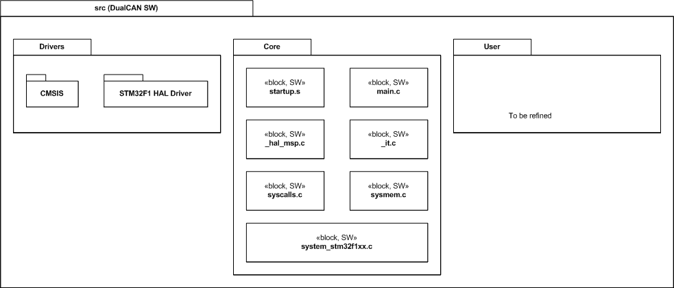

# Software Architecture

DualCAN software, in top level, consists of 3 packages of source code:

- Drivers: imported 3rd party source codes, including CMSIS and STM32F1 HAL driver.

- Core: generated by stm32CubeMX, with a little insertion in user code area.

- [User: hand written source code, to implement the required functionalities.](../src/User)

